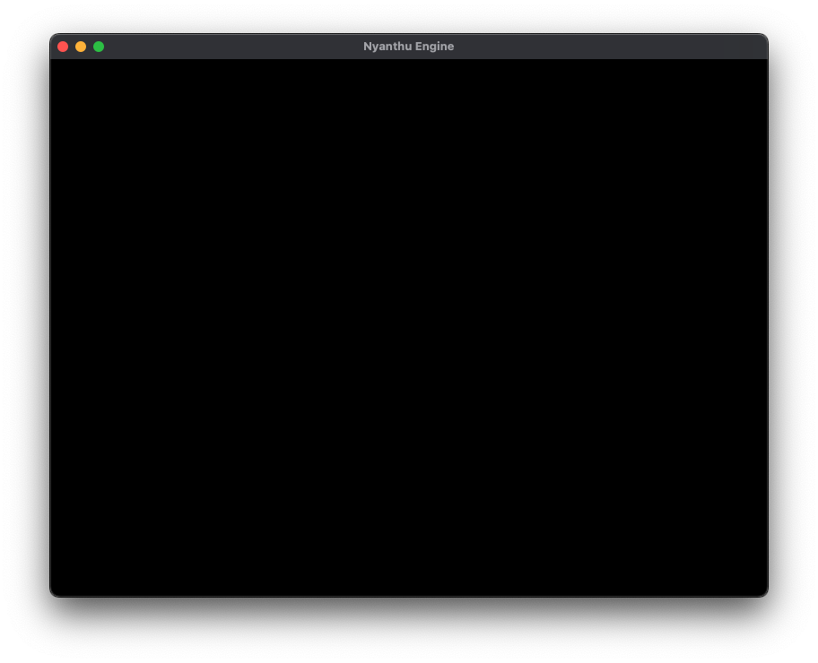

# Nyanthu Game Project System Structure

This document outlines the system architecture of the "Nyanthu Game" project, which is built around a custom game engine named "nyanthu_engine". The project is primarily written in C++ and uses CMake as its build system.


## 1. Project Overview

This project is structured as a game application built on top of a custom-developed game engine. Its primary goal is to provide a robust and modular foundation for game development.

*   **`application`**: This directory houses the specific game logic and assets, acting as the client that consumes the engine's functionalities. It compiles into the main executable.
*   **`nyanthu_engine`**: This is the core game engine, designed to be cross-platform and modular. It provides fundamental services such as rendering, audio processing, entity-component-system (ECS) management, and physics simulation.

## 2. Build System (CMake)

The project leverages CMake for its build process, employing a hierarchical structure to manage dependencies and build targets efficiently.

*   **Root `CMakeLists.txt` (`project_back/CMakeLists.txt`):**
    *   **Project Definition:** Defines the top-level project as `nyanthu_game`.
    *   **Subdirectory Inclusion:** Integrates the `application` directory as a primary build component.
    *   **Compiler Flag Configuration:** Sets global compiler flags (`CMAKE_C_FLAGS`, `CMAKE_CXX_FLAGS`, `CMAKE_OBJCXX_FLAGS`) to suppress specific warnings, notably `-Wno-error=incompatible-pointer-types`, ensuring broader compatibility across different compiler versions or strictness levels.

*   **Application `CMakeLists.txt` (`application/CMakeLists.txt`):**
    *   **Project Definition:** Defines a sub-project `game_project`.
    *   **Language Standards:** Enforces C++17 and Objective-C++17 standards for source compilation, ensuring modern language features are utilized.
    *   **Engine Integration:** Includes the `nyanchu_engine` as a subdirectory, directing its build output to `nyanchu_engine_build`. This establishes a clear dependency where the application relies on the engine.
    *   **Executable Creation:** Compiles the `game` executable from `src/main.cpp`, `src/application.cpp`, and `src/application.h`, which form the core of the game application.
    *   **Library Linking:** Links the `game` executable against the `nyanthu_engine` library, making all engine functionalities available to the game.
    *   **Include Path Management:** Configures include directories, allowing the application to correctly locate engine headers (`../nyanchu_engine/engine/include`) and its own source headers (`src`).
    *   **Post-Build Shader Copy:** A `POST_BUILD` custom command is set up to copy compiled shader binaries from the engine's build output directory to the game's executable directory. This ensures that the game has access to the necessary shader assets at runtime.
    *   **Platform-Specific Definitions:** For Apple platforms, specific compile definitions like `GLFW_INCLUDE_NONE` and `GLFW_EXPOSE_NATIVE_COCOA` are added, which are crucial for correct GLFW integration on macOS.

*   **Engine `CMakeLists.txt` (`nyanchu_engine/CMakeLists.txt`):**
    *   **Project Definition:** Defines the `nyanthu_engine` project, explicitly enabling C++ and Objective-C++ languages.
    *   **Language Standards:** Similar to the application, it enforces C++17 and Objective-C++17 standards.
    *   **Dependency Management with `FetchContent`:** This is a key feature for managing external libraries. `FetchContent` is used to automatically download, configure, and build third-party dependencies during the CMake generation phase. This ensures consistent dependency versions and simplifies project setup.
        *   **GLFW (Graphics Library Framework):** Used for creating windows, managing OpenGL/Metal contexts, and handling user input (keyboard, mouse, joystick).
        *   **GLM (OpenGL Mathematics):** A header-only library providing C++ classes and functions for geometric types and algorithms, highly optimized for graphics programming (e.g., vector, matrix operations).
        *   **Flecs:** A high-performance Entity Component System (ECS) library, crucial for managing game objects and their behaviors in a data-oriented way.
    *   **Shared Library Control:** `BUILD_SHARED_LIBS` is explicitly set to `OFF`, ensuring that all libraries are built statically, which simplifies deployment and avoids dynamic linking issues.
    *   **BGFX Integration:** Includes `external/bgfx.cmake`, which is responsible for integrating the BGFX rendering library and its associated tools (like `bimg` and `bx`).
    *   **Static Library Creation:** Builds `nyanthu_engine` as a static library, encapsulating all engine functionalities.
    *   **Conditional Compilation for Platform-Specifics:**
        *   **Apple (macOS/iOS):** Includes `engine/src/platform/platform_utils_macos.mm` for macOS-specific utility functions and `engine/src/renderer_metal.mm` for the Metal rendering backend. It links against essential Apple frameworks such as `Cocoa`, `Metal`, `QuartzCore`, and `MetalKit`. These `-framework` flags are crucial for linking against Apple's native Objective-C frameworks when using Objective-C++ for Metal rendering and other macOS-specific functionalities.
        *   **Other Platforms (e.g., Linux/Windows):** Includes `engine/src/renderer_opengl.cpp` for the OpenGL rendering backend.
    *   **Include Path Management:** Configures public include directories for the engine itself (`engine/include`) and its integrated external libraries (BGFX, GLM, Flecs).
    *   **Library Linking:** Links the engine library against its direct dependencies: `bgfx`, `bimg`, `bx`, `glfw`, and `flecs`.
    *   **Shader Compilation Pipeline:** A custom CMake target `compile_shaders` is defined to automate the shader compilation process. It uses BGFX's `shaderc` tool to transform human-readable `.sc` (shader source) files into platform-specific `.bin` (binary shader) formats. This process targets specific graphics APIs (e.g., Metal for macOS) and shader types (vertex, fragment), ensuring optimal performance and compatibility.

## 3. Application Layer (`application/`)

This layer represents the game itself, built on top of the engine. It defines the game's entry point and its main operational loop.

*   **`main.cpp`**: This is the absolute entry point of the entire application. Its sole responsibility is to instantiate the `Application` class, manage its lifecycle by calling `initialize()`, `run()`, and `shutdown()` methods, and handle the application's exit status.
*   **`application.h` / `application.cpp`**:
    *   **Application Wrapper:** The `Application` class serves as a high-level wrapper for the `nyanchu::Engine`. It encapsulates the game's specific initialization, update, and rendering logic.
    *   **Engine Instance:** It holds a `std::unique_ptr<nyanchu::Engine>`, ensuring proper ownership and automatic memory management of the engine instance.
    *   **Game Loop Orchestration:** The `run()` method contains the core game loop. It continuously polls events, prepares the frame (`beginFrame()`), executes game logic (demonstrated by example calls to `drawMesh` and `playSound`), and finalizes the frame (`endFrame()`). This structure allows for clear separation between engine-level and game-level concerns.
    *   **Engine Interaction:** It demonstrates how game-specific code interacts with the engine's exposed functionalities, such as rendering (`m_engine->getRenderer().drawMesh(...)`) and audio playback (`m_engine->getAudio().playSound(...)`).

## 4. Engine Layer (`nyanchu_engine/`)

The `nyanchu_engine` is a comprehensive, modular game engine designed to provide all the necessary low-level and high-level functionalities for game development.

### Core Engine (`engine/src/engine.cpp`)

*   **Central Hub:** The `nyanchu::Engine` class acts as the central orchestrator for all engine subsystems. It manages the overall lifecycle of the engine.
*   **Window Management:** It initializes GLFW, creates the main application window, and manages its context, providing the visual output surface for the game.
*   **Dynamic Renderer Instantiation:** Based on the detected platform, it dynamically instantiates the appropriate rendering backend (`RendererMetal` for Apple platforms, `RendererBGFX` for others). This ensures optimal graphics performance and API utilization for the target environment.
*   **Audio Subsystem:** Initializes an `Audio` object, providing the foundation for sound playback and management within the engine.
*   **Main Loop Control:** It manages the engine's main loop, handling event polling (`glfwPollEvents()`) and coordinating frame rendering (`beginFrame()`, `endFrame()`).
*   **Subsystem Access:** Provides public accessor methods (`getRenderer()`, `getAudio()`) to allow the application layer to interact with the engine's various subsystems.

### Subsystems

Each core functionality of the engine is encapsulated within a dedicated subsystem, promoting modularity and maintainability.

*   **ECS (Entity Component System):**
    *   **Implementation:** Located in `engine/src/ecs_flecs.cpp`.
    *   **Purpose:** An ECS is an architectural pattern that promotes composition over inheritance, leading to highly flexible, scalable, and performant game architectures. It separates data (Components) from behavior (Systems) and identifies unique game objects (Entities).
    *   **Library:** Utilizes the **Flecs** library, known for its high performance and rich feature set for ECS development, including queries, systems, and relationships.

*   **Audio:**
    *   **Implementation:** Handled by `engine/src/audio_miniaudio.cpp`.
    *   **Library:** Likely uses the **miniaudio** library, a single-file, cross-platform audio playback library. Its simplicity and efficiency make it suitable for embedding directly into game engines for sound effects and background music.
    *   **Functionality:** Responsible for loading, playing, pausing, and managing various audio sources within the game.

*   **Physics:**
    *   **Implementation:** Defined in `engine/src/physics_jolt.cpp`.
    *   **Library:** Indicates integration with the **Jolt Physics** library. Jolt is a high-performance, multi-threaded physics engine designed for games. Its presence suggests the engine supports realistic collision detection, rigid body dynamics, and other physics simulations. The fact that Jolt is not fetched via CMake implies it might be integrated as a pre-built binary, a system-wide library, or manually compiled and linked.

*   **Rendering:**
    *   **Cross-platform Abstraction (BGFX):** The engine employs **BGFX** as its primary rendering backend. BGFX is a low-level, cross-platform rendering library that provides a unified API over various native graphics APIs (like Direct3D 9/11/12, OpenGL, Metal, Vulkan). This abstraction allows the engine to target multiple platforms with a single rendering codebase.
    *   **Platform-Specific Implementations:**
        *   `engine/src/renderer_metal.mm`: This file contains the Metal API specific rendering implementation for Apple platforms (macOS, iOS). Metal is Apple's low-overhead, high-performance graphics API.
        *   `engine/src/renderer_opengl.cpp`: This file provides the OpenGL API specific rendering implementation for other platforms (e.g., Windows, Linux). OpenGL is a widely supported cross-platform graphics API.
    *   **Shader Compilation Pipeline:** The engine includes a robust shader compilation pipeline. Raw shader source files (`.sc` extension) are processed by BGFX's `shaderc` tool. This tool compiles the shaders into optimized, platform-specific binary formats (`.bin` extension). This pre-compilation step is crucial for runtime performance and ensures compatibility with the target graphics API (e.g., Metal shaders for macOS, GLSL for OpenGL).

### External Libraries

Beyond the core engine components, the project integrates several well-known third-party libraries to provide specialized functionalities:

*   **GLFW:** Essential for window creation, context management, and handling user input across different operating systems.
*   **GLM:** Provides highly optimized mathematical functions and types (vectors, matrices, quaternions) specifically tailored for graphics programming, ensuring correct transformations and calculations.
*   **Flecs:** The chosen ECS framework, enabling a data-oriented design approach for game entities and their behaviors.
*   **BGFX:** The foundational rendering library, abstracting away the complexities of various graphics APIs and providing a unified rendering interface.
*   **miniaudio:** A lightweight and efficient library for audio playback, suitable for embedding directly into the engine.
*   **Jolt Physics:** A high-performance physics engine, integrated for realistic simulation of rigid bodies and collisions.

### Platform-Specific Code

The engine is designed to be cross-platform while still leveraging native capabilities where beneficial. This is achieved through conditional compilation and platform-specific source files:

*   `engine/src/platform/platform_utils_macos.mm`: This file is written in Objective-C++ (`.mm` extension), which allows seamless interoperability between C++ and Apple's Objective-C frameworks (like Cocoa). It contains macOS-specific utility functions, such as obtaining the native window handle or interacting with Cocoa APIs. For instance, to get the `CAMetalLayer` from a GLFW window, Objective-C++ is used to bridge the C-style GLFW window pointer to an `NSWindow` object and then access its `contentView` and `layer` properties:

    ```objective-c
    #import <Cocoa/Cocoa.h>
    #import <QuartzCore/CAMetalLayer.h>
    #include <GLFW/glfw3.h>

    // Manually declare glfwGetCocoaWindow with extern "C" to ensure C linkage
    extern "C" {
        id glfwGetCocoaWindow(GLFWwindow* window);
    }

    void* getNativeWindowHandle(GLFWwindow* window) {
        NSWindow *nswin = glfwGetCocoaWindow(window);
        if (nswin.contentView.layer == nil) {
            [nswin.contentView setWantsLayer:YES];
            CAMetalLayer* layer = [CAMetalLayer layer];
            nswin.contentView.layer = layer;
        }
        return (__bridge void*)nswin.contentView.layer;
    }
    ```
    This snippet demonstrates the use of `#import` for Objective-C headers, Objective-C message passing syntax (`[object method]`), and the `__bridge` cast for managing ownership between Objective-C objects and C pointers.

*   `engine/src/renderer_metal.mm`: Implements the rendering logic using Apple's Metal API, providing direct access to GPU hardware for optimal performance on Apple devices. This file also uses Objective-C++ to interact with Metal framework objects.
*   `engine/src/renderer_opengl.cpp`: Implements the rendering logic using the OpenGL API, serving as the primary graphics backend for non-Apple platforms.

## 5. Directory Structure (Key Directories)

*   **`/` (project_back):** The root directory of the entire project.
    *   `CMakeLists.txt`: The top-level CMake configuration file that orchestrates the entire build.
    *   `設計書.md`: A design document, likely containing high-level architectural decisions or game design specifications in Japanese.
*   **`application/`:** Encapsulates all code and assets specific to the game application.
    *   `CMakeLists.txt`: CMake configuration for building the game executable.
    *   `materials/`: Stores game assets, such as audio files (e.g., `8bit-tokinokaze.wav`).
    *   `src/`: Contains the C++ source code for the game application (`main.cpp`, `application.cpp`, `application.h`).
*   **`nyanchu_engine/`:** Contains the source code and build configurations for the custom game engine.
    *   `CMakeLists.txt`: CMake configuration for building the engine library.
    *   `engine/`: Core engine source code.
        *   `include/nyanchu/`: Public header files that define the engine's API, accessible to the application.
        *   `src/`: Implementation files for various engine subsystems (audio, ecs, physics, renderers, platform utilities).
    *   `external/`: Manages external dependencies. Notably, `bgfx.cmake` handles the integration of the BGFX rendering library and its associated tools.
    *   `shaders/`: Stores the raw, human-readable shader source files (`.sc`) before compilation.
    *   `LICENSES/`: Contains license information for all third-party libraries used within the engine.
*   **`build/`:** This directory is generated by CMake and contains all build artifacts.
    *   `_deps/`: Contains the source code and build directories for dependencies managed by `FetchContent` (e.g., Flecs, GLFW, GLM).
    *   `application/`: The build output directory for the `game` executable.
    *   `nyanchu_engine_build/`: The build output directory for the `nyanthu_engine` static library.
    *   `shaders/`: Contains the compiled binary shader files (`.bin`) ready for use by the engine at runtime.
